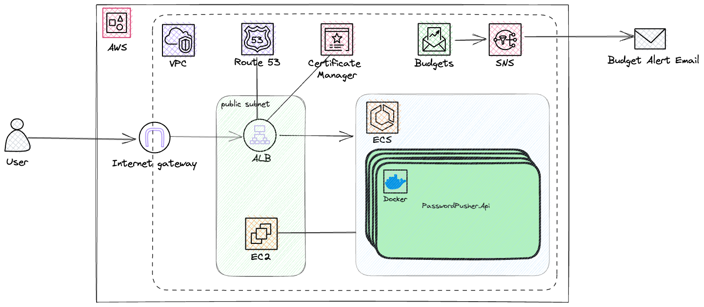

# Password Pusher
That is suppose to be a pet project for building small but usefull service to help share passwords in a simple, secure and quick way. The main goal of that project is to play around with and learn some technologies, tools, platforms and approaches.

## Decisions and choices:
- Infrastructure - AWS (because of Free Tier, this is a pet project, so the budget is pretty limited 😜)
- Technologies - [Springboot](https://spring.io/), [Gradle(via Kotlin)](https://gradle.org/), [React](https://react.dev), [Terraform](https://www.terraform.io/), [Docker](https://docker.io/)
- Diagram - [Excalidraw](https://excalidraw.com)
- CI/CD - [Github Actions](https://github.com/features/actions)
- Observability - [AWS CloudWatch](https://aws.amazon.com/cloudwatch/)(at least at the beginning), but with a plan to connect [NewRelic](https://newrelic.com/)
- Docker container registry - [GitHub Packages](https://github.com/features/packages)

## Environments:
- Development - https://dev.pw-pusher.click
- Production - https://pw-pusher.click

## Continious Integration/Deployment
- 
- 
- 

## Architecture

## Deployment
### Development
Deployment for [Development environment](https://dev.pw-pusher.click) is done automatically by pipeline  during creating Pull Requests, and after push/tag of master.
### Production
Deployment for [Production environment](https://pw-pusher.click) is done manually by pipeline  by providing version (tag) value.